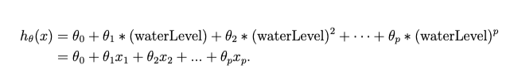

# Machine Learning (MATLAB) - Regularized Linear Regression and Bias/Variance

Machine Learning course from Stanford University on [Coursera](https://www.coursera.org/learn/machine-learning/programming/Im1UC/regularized-linear-regression-and-bias-variance).

### Environment
- macOS Catalina (version 10.15.3)
- MATLAB 2018 b

### Dataset
- ex5data1.mat

### Files included in this repo
- ex5.m - Octave/MATLAB script that steps through the exercise 
- ex5data1.mat - Dataset
- submit.m - Submission script that sends solutions to our servers 
- featureNormalize.m - Feature normalization function
- fmincg.m - Function minimization routine (similar to fminunc) 
- plotFit.m - Plot a polynomial fit
- sigmoid.m - Sigmoid function
- trainLinearReg.m - Trains linear regression using cost function 

[⋆] linearRegCostFunction.m - Regularized linear regression cost function

[⋆] learningCurve.m - Generates a learning curve

[⋆] polyFeatures.m - Maps data into polynomial feature space 

[⋆] validationCurve.m - Generates a cross validation curve

### Part 1: Regularized Linear Regression
We will implement regularized linear regression to predict the amount of water flowing out of a dam using the change of water level in a reservoir.

#### Part 1.1: Loading and Visualizing Data  
We will begin by visualizing the dataset containing historical records on the change in the water level, x, and the amount of water flowing out of the dam, y.

This dataset is divided into three parts: 
- A training set that your model will learn on: X, y  
- A cross validation set for determining the regularization parameter: Xval, yval 
- A test set for evaluating performance. These are “unseen” examples which your model did not see during training: Xtest, ytest  

```
% Load from ex5data1: 
% You will have X, y, Xval, yval, Xtest, ytest in your environment
load ('ex5data1.mat');
```


- Figure: Dataset


#### Part 1.2: Regularized Linear Regression Cost Function  
The regularized cost function for linear regression:  
  
where λ is a regularization parameter which controls the degree of regularization (thus, help preventing overfitting). The regularization term puts a penalty on the overal cost J. As the magnitudes of the model parameters θj increase, the penalty increases as well.

##### linearRegCostFunction.m 
```
% Regularized linear regression cost function
h = (X * theta);
J = (1/(2*m)) * sum((h-y).^2) + (lambda/(2 * m)) * sum(theta(2:end).^2);
```

Result: Cost at theta = [1 ; 1]: 303.993192 

#### Part 1.3: Regularized linear regression gradient   
The partial derivative of regularized linear regression’s cost for θj is defined as
  

##### linearRegCostFunction.m 
```
% Regularized linear regression gradient function
grad = (1/m * X' * (h - y)) + [0;(lambda/m) * theta(2:end)];
```

Result: Gradient at theta = [1 ; 1]:  [-15.303016; 598.250744] 


#### Part 1.4: Fitting Linear Regression 
Once we get done with implementing cost and gradient function, we need to compute the optimal values of θ. *trainLinearReg.m*, this training function uses fmincg to optimize the cost function.

##### trainLinearReg.m - Trains linear regression using cost function 
```
% Initialize Theta
initial_theta = zeros(size(X, 2), 1); 

% Create "short hand" for the cost function to be minimized
costFunction = @(t) linearRegCostFunction(X, y, t, lambda);

% Now, costFunction is a function that takes in only one argument
options = optimset('MaxIter', 200, 'GradObj', 'on');

% Minimize using fmincg
theta = fmincg(costFunction, initial_theta, options);
```

We set regularization parameter λ to zero. Because our current implementation of linear regression is trying to fit a 2-dimensional θ, regularization will not be incredibly helpful for a θ of such low dimension.

The best fit line tells us that the model is not a good fit to the data because the data has a non-linear pattern.

 
- Fig. Linear Fit

In the next section, we will implement a function to generate learning curves that can help debug our learning algorithm even if it is not easy to visualize the data.


## Part 2: Bias-variance
An important concept in machine learning is the bias-variance tradeoff. Models with high bias are not complex enough for the data and tend to underfit, while models with high variance overfit to the training data.

We will plot training and test errors on a learning curve to diagnose bias-variance problems.

### Part 2.1: Learning Curve for Linear Regression  
We will now implement code to generate the learning curves that will be useful in debugging learning algorithms. We fill in learningCurve.m so that it returns a vector of errors for the training set and cross validation set.

To plot the learning curve, we need a training and cross validation set error for different training set sizes. To obtain different training set sizes, we should use different subsets of the original training set X. Specifically, for a training set size of i, we should use the first i examples (i.e., X(1:i,:) and y(1:i)).

We use trainLinearReg function to find the θ parameters. Note that the lambda is passed as a parameter to the learningCurve function. After learning the θ parameters, we should compute the error on the train- ing and cross validation sets. 
The training error for a dataset is defined as
  

The training error does not include the regularization term. One way to compute the training error is to use your existing cost function and set λ to 0 only when using it to compute the training error and cross validation error.

When you are computing the training set error, make sure we compute it on the training subset (i.e., X(1:n,:) and y(1:n)) (instead of the entire training set). However, for the cross validation error, we should compute it over the entire cross validation set. we should store the computed errors in the vectors error train and error val.

##### learningCurve.m
``` 
%Generates a learning curve
for i = 1:m
    theta = trainLinearReg(X(1:i,:), y(1:i), lambda);
    error_train(i) = linearRegCostFunction(X(1:i,:),y(1:i),theta, 0);
    error_val(i) = linearRegCostFunction(Xval, yval, theta, 0);
end
```


- Figure: Linear Regression learning curve  

We can observe that both the train error and cross validation error are high when the number of training examples is increased. This reflects a high bias problem in the model – the linear regression model is too simple and is unable to fit our dataset well.

## Part 3: Polynomial regression

Linear model was too simple for the data and resulted in underfitting (high bias). We now add more features, which is called as polynomial terms.

For use polynomial regression, our hypothesis has the form:


By defining x1 =(waterLevel),x2 =(waterLevel)^2,...,xp = (waterLevel)^p, we obtain a linear regression model where the features are the various powers of the original value (waterLevel).

We will add more features using the higher powers of the existing feature x in the dataset. polyFeatures.m function maps the original training set X of size m × 1 into its higher powers. Specifically, when a training set X of size m × 1 is passed into the function, the function should return a m×p matrix X poly, where column 1 holds the original values of X, column 2 holds the values of X.^2, column 3 holds the values of X.^3, and so on. Note that you don’t have to account for the zero-eth power in this function.  

##### polyFeatures.m  
```
% Maps data into polynomial feature space
X = X_poly(:,1); % size m × 1

for i = 2:p
    % polynomial regression
    X_poly(:,i) = X .* X_poly(:,i-1);
end
```

### Part 3.1: Feature Mapping for Polynomial Regression 
We will proceed to train polynomial regression using linear regression cost function.

Note: we will be using a polynomial of degree 8. It turns out that if we run the training directly on the projected data, will not work well as the features would be badly scaled (e.g., an example with x = 40 will now have a feature x8 = 408 = 6.5 × 1012). Therefore, we will need to use feature normalization.


- Figure: Polynomial fit, λ = 0

Here we find the polynomial able to fit the datapoints very well- thus, obtaining a low training error. However, the polynomial fit is very complex and even drops off at the extremes. This is an indicator that the polynomial regression model is overfitting the training data and will not generalize well.

To better understand the problems with the unregularized (λ = 0) model, we can see that the learning curve (below) shows the same effect where the low training error is low, but the cross validation error is high. There is a gap between the training and cross validation errors, indicating a high variance problem.


- Figure: Polynomial learning curve, λ = 0

One way to combat the overfitting (high-variance) problem is to add regularization to the model.

### Part 3.2: Adjusting the regularization parameter
We will get to observe how the regularization parameter affects the bias-variance of regularized polynomial regression. 

We can modify the lambda parameter in the *ex5.m* and try λ = 1, 100. For each of these values, the script should generate a polynomial fit to the data and also a learning curve.

For λ = 1, We should see a polynomial fit that follows the data trend well and a learning curve showing that both the cross validation and training error coverage to a relatively low value. This shows the λ = 1 regularized polynomial regression model does not have the high- bias or high-variance problems. In effect, it achieves a good trade-off between bias and variance.


- Figure: Polynomial fit, λ = 1


- Figure: Polynomial learning curve, λ = 1

For λ = 100, we see a polynomial fit that does not follow the data well. In this case, there is too much regularization and the model is unable to fit the training data.


- Figure: Polynomial fit, λ = 100

### Part 3.3: Selecting λ using a cross validation set

Here, we implement an automated method to select the λ parameter.
Concretely, we use a cross validation set to evaluate how good each λ value is. After selecting the best λ value using the cross validation set, we can then evaluate the model on the test set to estimate how well the model will perform on actual unseen data.

##### validationCurve.m
```
% Generates a cross validation curve


```


- Figure: Selecting λ using a cross validation set

We can see that the best value of λ is around 3. Due to randomness in the training and validation splits of the dataset, the cross validation error can sometimes be lower than the training error.

### Part 3.4: Computing test set error

We implemented code to compute the cross validation error for various values of the regularization parameter λ. However, to get a better indication of the model’s performance in the real world, it is important to evaluate the “final” model on a test set that was not used in any part of training (that is, it was neither used to select the λ parameters, nor to learn the model parameters θ).

In our cross validation, we obtained a test error of 3.8599 for λ = 3.


### Part 3.5: Plotting learning curves with randomly selected examples

Especially for small training sets, when we plot learning curves to debug your algorithms, it is often helpful to average across multiple sets of randomly selected examples to determine the training error and cross validation error.


- Figure: Learning curve with randomly selected examples


## Course Links 

1) Machine Learning by Stanford University on [Coursera](https://www.coursera.org/learn/machine-learning/programming/Im1UC/regularized-linear-regression-and-bias-variance).

2) [Regularized Linear Regression](https://www.coursera.org/learn/machine-learning/home/week/6)
(Please notice that you need to log in to see the programming assignment.) #ML-Neural_Networks_Learning-MATLAB